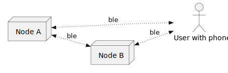
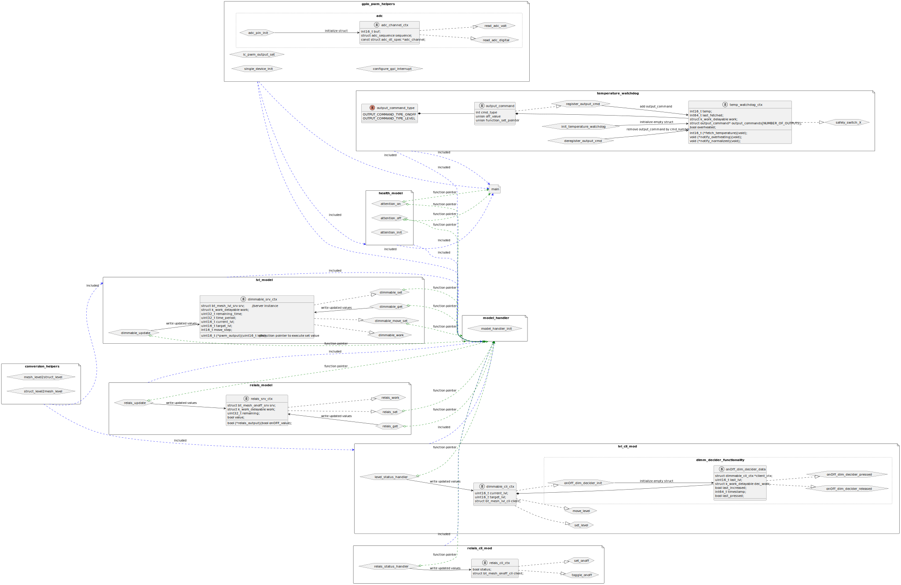
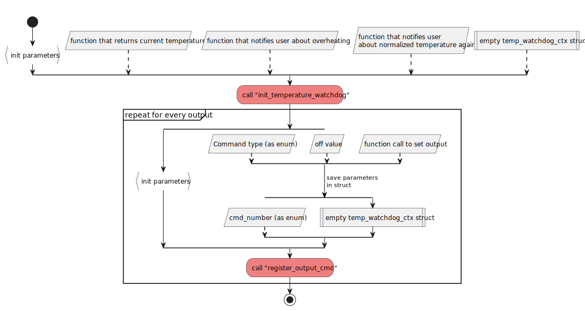
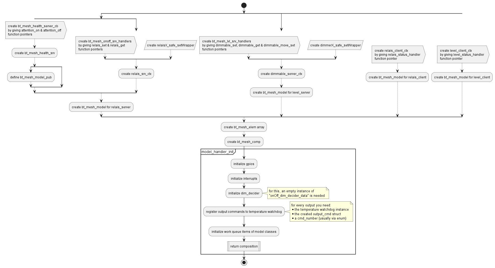
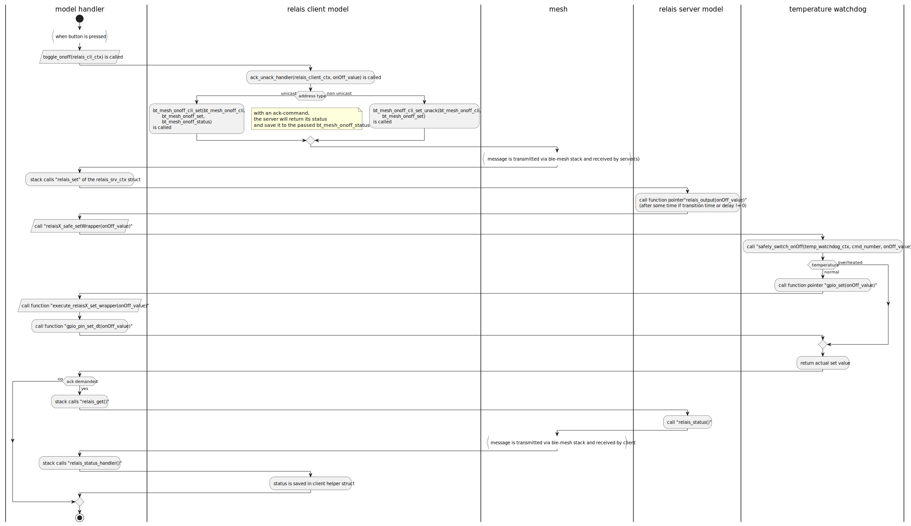
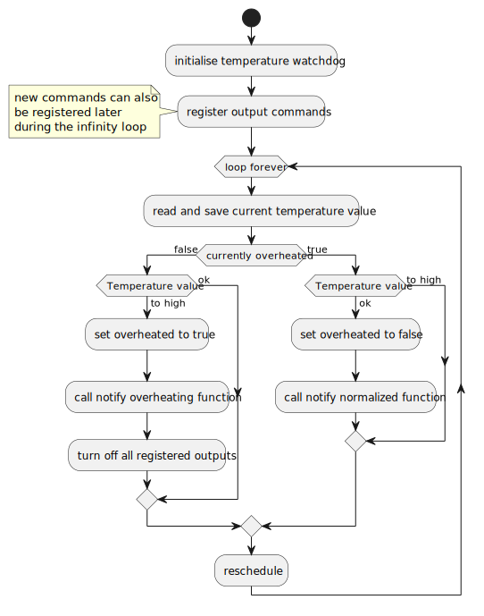
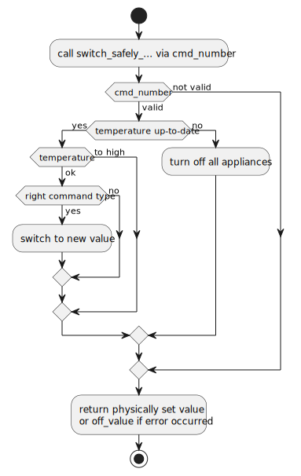
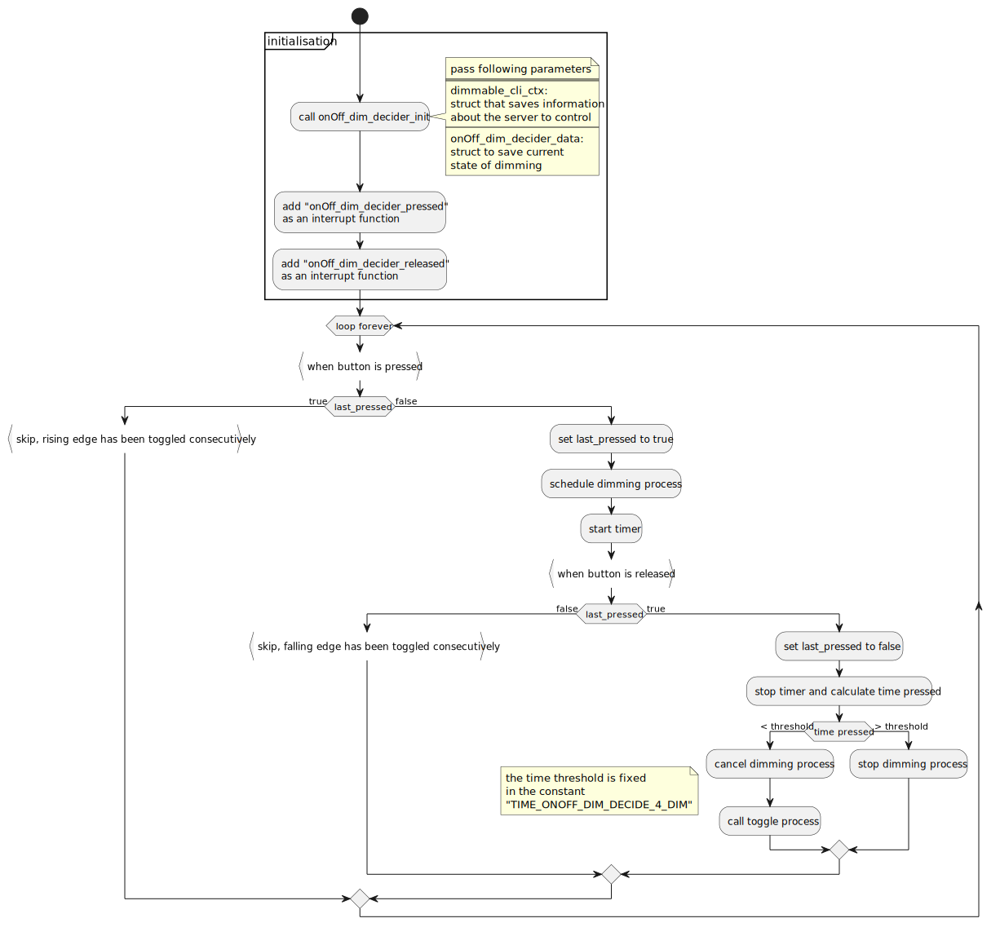

.. _bluetooth_mesh_smart_home:

Software for smart home control via Bluetooth Mesh
##################################################

.. contents::
   :local:
   :depth: 2

This software is supposed to be flashed onto the little sensor / actor pcbs.
These boards will be able to communicate with each other via Bluetooth Mesh or with
a smartphone via an application as shown in the following figure:

One possible application for controlling the nodes via smartphone is Semiconductor's nRF Mesh mobile app installed in one of the following versions:

  * `nRF Mesh mobile app for Android`_
  * `nRF Mesh mobile app for iOS`_

Requirements
************

The sample supports the following hardware:

* `nRF52832 DK`_
* `thu prototype pcb V1.0`_

Overview
********

This software implements several generic models for smart home applications with a provisionee role in a mesh network.
The models are used to:

* control the relais output
* control the pwm output, e.g. for dimming a light
* send a message to control a relais in the network
* send a message to control (change pwm or turn on or off) a pwm output in the network

Provisioning is performed using the `nRF Mesh mobile app`_.
This mobile application is also used to configure key bindings, and publication and subscription settings of the Bluetooth mesh model instances.
After provisioning and configuring the mesh models supported by the sample in the `nRF Mesh mobile app`_, you can control the outputs of the pcb.

Provisioning
============

The provisioning is handled by the function ``bt_mesh_MY_prov_init`` in :file:`src/main.c`.
No OOB authentication is supported, but the board will blink during identification.
This allows the user to identify the board he currently is provisioning.

Models
======

The following table shows the node composition for the prototype boards. 
All these elements will be available on the boards, although the boards don't necessarily support all these elements. 
This depends on what assembly option has been chosen for the board (e.g. if a relais is installed on the board).
The user is responsible for only adding application keys to the elements that are available on the board.

.. table::
   :align: center

   =================  =================  =================  =================
   Element 1          Element 2          Element 3          Element 4
   =================  =================  =================  =================
   Config Server      Gen. Level Server  Gen. OnOff Client  Gen. Level Client
   Health Server
   Gen. OnOff Server
   =================  =================  =================  =================

The models are used for the following purposes:

* Config Server allows configurator devices to configure the node remotely (this is a standard model every node possesses).
* Health Server provides ``attention`` callbacks that are used during provisioning to call your attention to the device.
  These callbacks trigger blinking of the InfoLED (this is a standard model every node possesses).
* Generic OnOff Server is used to control the relais on the board.
* Generic OnOff Client is used to send a toggle message to a Gen. OnOff Server, so to switch the relais on or off.
* Generic Level Server is used to control the brightness of an LED actor (dimming).
* Generic Level Client is used to change the level or turn on or off of a Gen. Level Server, so to e.g. control a dimmable LED.

The model handling is implemented in :file:`src/model_handler.c`.

User interface
**************

Input terminal:
   A 230V button or switch can be connected to this port. The element that is controlled by this button is set by one of the following define statements in :file:`src/model_handler.c`:

   * `__RELAIS_CTR_BY_BUTTON`: the Gen. OnOff Client is adressed. 
    On every push of the button, a message to toggle a relais is sent.
   * `__RELAIS_CTR_BY_LEVER`: the Gen. OnOff Client is adressed. 
    The relais is turned on, when the switch connects line and is turned off, when line is disconnected through the switch.
   * `__DIMM_CTR_BY_BUTTON`: the Gen. Level Client is adressed. 
    On a short push, the PWM-output is toggled on or off respectively. 
    On a long push, the level is increased or decreased respectively.

LEDs:
  * The InfoLED blinks when the device is identified during provisioning or when the node overheated.
  * The WarnLED currently is not used.

Output terminal:
   * The relais is controlled by the Gen. OnOff Server. It is approved for switching up to 230V AC at 16A.
   * The PWM-output would be controlled by the Gen. Level Server. 
    The necessary assembly option currently is missing, consequently currently no (hardware) PWM-output is available.
    This model can still be used for testing purposes.

Source file setup
*****************

This sample is split into the following source files:

* :file:`main.c` used to handle temperature watchdog initialization, provisioning and calls Bluetooth initialization.
* :file:`temperature_watchdog.c` used to regularly check pcb temperature and turn off the outputs in case of overheating.
* :file:`gpio_pwm_helpers.c` includes functions for initializing gpio and pwm pins.
* :file:`conversion_helpers.c` includes general helper functions (transform data types, ...)
* :file:`model_handler.c` used to initialize and compose bluetooth mesh models.
* :file:`health_model.c` includes the mandatory Mesh health model.
* :file:`relais_model.c` includes the OnOff server model.
* :file:`relais_cli_mod.c` includes the OnOff client model.
* :file:`lvl_model.c` includes the level server model.
* :file:`lvl_cli_mod.c` includes the level client model.
* :file:`lightness_model.c` includes the lightness server.

The following diagram shows the available structs and public functions each source file adds to the project.
At too, the dependencies between the source files are shown:

Using
*****

After programming, you can configure the mesh by using a smartphone with `nRF Mesh mobile app`_ installed.
Configuration consists of provisioning the device and configuring the appropriate models.

Provisioning the device
=======================

The provisioning assigns an address range to the device, and adds it to the mesh network. 
Complete the following steps in the nRF Mesh app:

   * Tap `Add node` to start scanning for unprovisioned mesh devices.
   * Select the `THU SH Mesh` device to connect to it.
   * Tap Identify (InfoLED starts blinking), and then Provision, to provision the device.

Once the provisioning is complete, the app returns to the Network screen.

Configuring models
==================

It is practical to only configure the models that have corresponding hardware present on the node.

  1. Bind the model to an Application key (all models with the same application key are able to communicate with each other)

You can already control the server element via the app now.

  2. If a client: Add a publish address to the client. The address determines to which server(s) the commands will be send to.

Code Working principles
***********************

Initialization:
===============

Temperature watchdog:
---------------------

At first, the temperature watchdog is initialized.
This is done in main.c.
The watchdog is used to turn off the outputs in case of overheating.
The following picture illustrates the process, the needed parameters and structs that have to be defined.

   Process for Temperature watchdog initialization

Model initialization:
---------------------

Then, the models are initialized.
This is done in model_handler.c.
The following picture illustrates again the process, the needed parameters and structs that have to be defined.

   Process for Model initialization

Operation:
==========

The following figure shows an example operation for controlling an onOff-server via an onOff-client.
All the function calls between the different modules are listed here. This should give you a good overview of the code structure:

   Process for controlling an onOff-server via an onOff-client

Details about the temperature watchdog functionality:
-----------------------------------------------------

The shown process relies on a fetch of the current temperature.
The following figure shows the process for fetching the temperature, checking for overheating and turning off the outputs in case of overheating:

   Process for fetching and processing the temperature

The temperature watchdog also prevents outputs from being turned on again during overheating.
The following figure illustrates how this works:

   Mechanism for preventing outputs from being turned on during overheating

Details about the Decider functionality for Dimming:
----------------------------------------------------

It is possible to dimm and turn on or off a light via a single button.
By a short press, the light is turned on or off respectively.
By a long press, the light is dimmed up or down respectively.
The following figure shows the process in detail:

   Process for dimming and turning on or off a light via a single button

